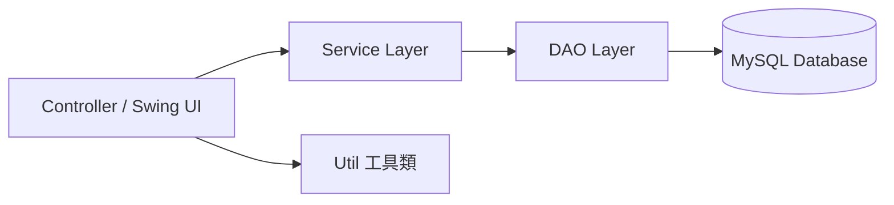
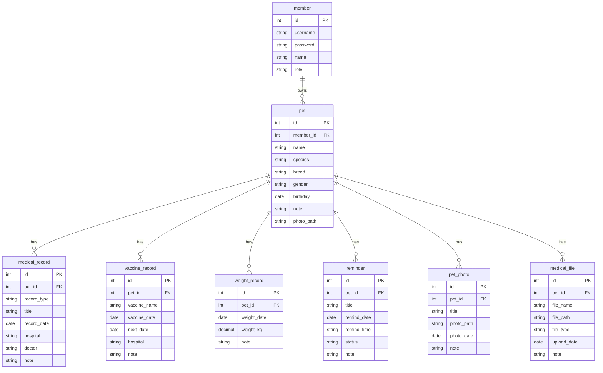
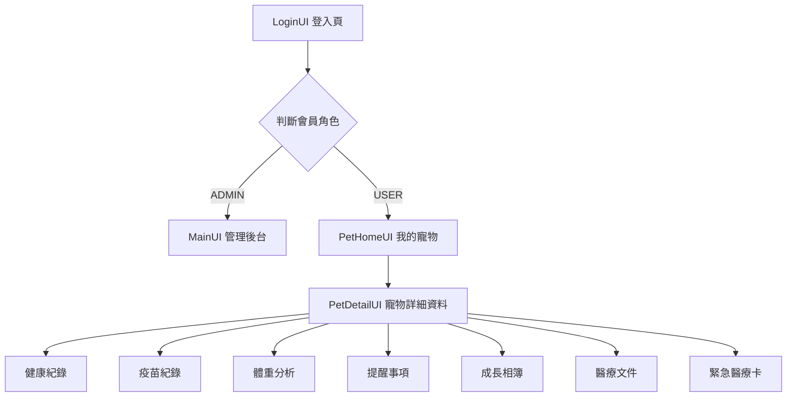

# 🐾 PetCare｜寵物健康紀錄管理系統


## 📌 專案簡介

**PetCare** 是一套使用 **Java Swing + JDBC + MySQL** 開發的桌面版寵物健康管理系統，主要協助飼主管理寵物的基本資料、健康紀錄、疫苗紀錄、體重追蹤、提醒事項、醫療文件、成長相簿與緊急醫療卡。

本專案以桌面應用程式為基礎，結合資料庫 CRUD、會員登入、角色權限、檔案上傳、日曆選擇器與列印功能，模擬真實寵物照護情境，讓使用者能夠集中管理毛孩的健康資訊。

專案採用 **Controller / Service / DAO / Entity / Util** 分層設計，讓畫面邏輯、商業邏輯與資料庫操作分離，提升程式碼可讀性與維護性。

---

## 🎯 專案目標

此專案主要練習並整合以下能力：

- Java Swing 桌面應用程式開發
- Maven 專案管理
- JDBC 連接 MySQL 資料庫
- DAO / Service 分層架構
- 會員登入與角色權限判斷
- 多資料表 CRUD 操作
- JTable 資料呈現與後台管理
- JFileChooser 檔案 / 圖片上傳
- 自訂 Swing 元件與 UI 樣式
- 體重趨勢圖表繪製
- 緊急醫療摘要列印功能

---

## ✨ 系統特色

- 🔐 **會員登入與註冊**
  - 使用帳號密碼登入系統
  - 依照角色導向不同首頁

- 👤 **角色權限區分**
  - `ADMIN`：可進入管理後台，查看系統資料
  - `USER`：可管理自己的寵物健康紀錄

- 🐶 **寵物資料管理**
  - 新增、編輯、刪除寵物資料
  - 支援寵物照片上傳
  - 顯示品種、性別、生日、備註等資訊

- 🏥 **健康紀錄管理**
  - 記錄看診、健康檢查、治療等資料
  - 可填寫醫院、醫師、看診日期與備註

- 💉 **疫苗紀錄管理**
  - 記錄疫苗名稱、施打日期與下次施打日期
  - 協助飼主追蹤疫苗排程

- ⚖️ **體重分析**
  - 新增體重紀錄
  - 顯示最新體重與平均體重
  - 透過折線圖觀察體重變化
  - 根據體重變化顯示健康狀態提示

- ⏰ **提醒事項**
  - 建立回診、疫苗、照護等提醒
  - 可記錄提醒日期、時間與完成狀態

- 🖼️ **成長相簿**
  - 上傳寵物照片
  - 記錄照片日期、標題與備註

- 📁 **醫療文件管理**
  - 上傳健康檢查報告、檢驗報告等醫療文件
  - 保留檔案名稱、類型、上傳日期與備註

- 🆘 **緊急醫療卡**
  - 彙整寵物重要健康資訊
  - 包含基本資料、最新體重、近期健康紀錄、疫苗紀錄與提醒
  - 支援列印，方便緊急送醫時提供給獸醫參考

- 🗓️ **日期選擇器**
  - 日期欄位可透過日曆選取
  - 減少手動輸入錯誤
  - 提升使用者操作體驗

---

## 🧩 功能模組總覽

| 模組 | 功能內容 | 對應畫面 / 類別 |
| --- | --- | --- |
| 會員系統 | 登入、註冊、帳號檢查、Session 管理 | `LoginUI`, `RegisterUI`, `LoginSession` |
| 管理後台 | 管理員查看會員、寵物、健康紀錄等資料 | `MainUI`, `AdminTableUI` |
| 寵物首頁 | 顯示目前使用者的寵物列表 | `PetHomeUI` |
| 寵物資料 | 新增、編輯、刪除寵物基本資料 | `AddPetUI`, `EditPetUI`, `PetDetailUI` |
| 健康紀錄 | 新增與查看看診 / 健康紀錄 | `MedicalRecordListUI`, `AddMedicalRecordUI` |
| 疫苗紀錄 | 新增與查看疫苗資料 | `VaccineRecordListUI`, `AddVaccineRecordUI` |
| 體重分析 | 記錄體重、顯示折線圖與狀態 | `WeightRecordListUI`, `AddWeightRecordUI` |
| 提醒事項 | 新增提醒、查看完成狀態 | `ReminderListUI`, `AddReminderUI` |
| 成長相簿 | 上傳與查看寵物照片 | `PetPhotoListUI`, `AddPetPhotoUI` |
| 醫療文件 | 上傳與查看醫療文件 | `MedicalFileListUI`, `AddMedicalFileUI` |
| 緊急醫療卡 | 彙整健康摘要並提供列印 | `EmergencySummaryUI` |

---

## 🛠️ 使用技術

| 類別 | 技術 |
| --- | --- |
| 程式語言 | Java 8+ |
| GUI | Java Swing |
| 專案管理 | Maven |
| 資料庫 | MySQL 8.0+ |
| 資料庫連線 | JDBC |
| Driver | MySQL Connector/J 8.0.33 |
| IDE | Eclipse / WindowBuilder |
| 架構設計 | MVC 概念、DAO Pattern、Service Layer |

---

## 🏗️ 系統架構



### 架構說明

| 層級 | Package | 職責 |
| --- | --- | --- |
| Controller | `controller` | Swing 畫面、按鈕事件、頁面切換 |
| Service | `service`, `service.impl` | 處理功能邏輯，串接 DAO |
| DAO | `dao`, `dao.impl` | 負責 SQL 查詢與資料庫 CRUD |
| Entity | `entity` | 對應資料表的 Java 物件 |
| Util | `util` | 資料庫連線、登入狀態、UI 樣式、日期選擇器、CRUD 工具 |

---

## 🗂️ 專案結構

```text
PetCare
├── pom.xml
├── sql
│   └── mysql.sql
├── uploads
│   └── pet_photos
├── src
│   └── main
│       ├── java
│       │   ├── controller
│       │   │   ├── LoginUI.java
│       │   │   ├── RegisterUI.java
│       │   │   ├── MainUI.java
│       │   │   ├── AdminTableUI.java
│       │   │   ├── PetHomeUI.java
│       │   │   ├── PetDetailUI.java
│       │   │   ├── AddPetUI.java
│       │   │   ├── EditPetUI.java
│       │   │   ├── MedicalRecordListUI.java
│       │   │   ├── VaccineRecordListUI.java
│       │   │   ├── WeightRecordListUI.java
│       │   │   ├── ReminderListUI.java
│       │   │   ├── PetPhotoListUI.java
│       │   │   ├── MedicalFileListUI.java
│       │   │   └── EmergencySummaryUI.java
│       │   ├── dao
│       │   ├── dao.impl
│       │   ├── entity
│       │   ├── service
│       │   ├── service.impl
│       │   └── util
│       │       ├── DbConnection.java
│       │       ├── LoginSession.java
│       │       ├── ModernUI.java
│       │       ├── DatePickerField.java
│       │       ├── BackgroundPanel.java
│       │       └── CrudHelper.java
│       └── resources
│           └── images
│               ├── logo.png
│               ├── login_bg.png
│               └── default_pet.png
```

---

## 🗃️ 資料庫設計

本系統使用 `petcare` 資料庫，主要包含以下資料表：

| 資料表 | 說明 |
| --- | --- |
| `member` | 會員帳號、密碼、姓名、角色 |
| `pet` | 寵物基本資料與照片路徑 |
| `medical_record` | 健康紀錄 / 看診紀錄 |
| `vaccine_record` | 疫苗施打紀錄 |
| `weight_record` | 體重紀錄 |
| `reminder` | 提醒事項 |
| `pet_photo` | 成長相簿照片 |
| `medical_file` | 醫療文件上傳紀錄 |

### ER Diagram



---

## 🔐 角色權限設計

| 角色 | 權限說明 |
| --- | --- |
| `ADMIN` | 可進入管理後台，查看會員、寵物、健康紀錄、提醒、疫苗、體重、相簿與醫療文件等系統資料 |
| `USER` | 可登入個人寵物首頁，管理自己所建立的寵物與相關健康紀錄 |

登入後系統會依照 `member.role` 判斷角色：

```java
String role = member.getRole();

if (role.equals("ADMIN")) {
    MainUI main = new MainUI();
    main.setVisible(true);
} else if (role.equals("USER")) {
    PetHomeUI petHome = new PetHomeUI();
    petHome.setVisible(true);
}
```

---

## 🚀 安裝與執行方式

### 1️⃣ 下載專案

```bash
git clone https://github.com/你的帳號/PetCare.git
```

或直接下載 ZIP 後解壓縮。

---

### 2️⃣ 匯入 Eclipse

1. 開啟 Eclipse
2. 點選 `File`
3. 選擇 `Import`
4. 選擇 `Existing Maven Projects`
5. 選擇 `PetCare` 專案資料夾
6. 點選 `Finish`
7. 等待 Maven 自動下載相依套件

---

### 3️⃣ 建立 MySQL 資料庫

請先確認 MySQL Server 已啟動，接著執行：

```sql
source sql/mysql.sql;
```

或使用 MySQL Workbench：

1. 開啟 MySQL Workbench
2. 連線到本機資料庫
3. 開啟 `sql/mysql.sql`
4. 點選執行全部 SQL
5. 確認產生 `petcare` 資料庫

---

### 4️⃣ 修改資料庫連線設定

請確認 `src/main/java/util/DbConnection.java` 的資料庫設定符合你的環境：

```java
String url = "jdbc:mysql://localhost:3306/petcare";
String user = "root";
String password = "1234";
```

如果你的 MySQL 密碼不是 `1234`，請改成自己的密碼。

---

### 5️⃣ 執行專案

在 Eclipse 中開啟：

```text
src/main/java/controller/LoginUI.java
```

右鍵選擇：

```text
Run As > Java Application
```

## 📦 打包與執行 JAR

本專案為 Java Swing 桌面應用程式，並且需要連接 MySQL 資料庫，因此執行 JAR 前請先確認：

* 已安裝 Java
* 已啟動 MySQL Server
* 已建立 `petcare` 資料庫
* 已執行 `sql/mysql.sql`
* `DbConnection.java` 中的資料庫帳號與密碼正確

### 使用 Maven 打包

在專案根目錄執行：

```bash
mvn clean package
```

打包完成後，JAR 檔會產生在：

```text
target/PetCare-0.0.1-SNAPSHOT.jar
```

### 使用指令執行 JAR

建議使用終端機或 CMD 執行，方便查看錯誤訊息：

```bash
java -jar target/PetCare-0.0.1-SNAPSHOT.jar
```

### 常見 JAR 執行問題

| 錯誤訊息                                               | 可能原因                      |
| -------------------------------------------------- | ------------------------- |
| `no main manifest attribute`                       | JAR 沒有設定 Main-Class       |
| `ClassNotFoundException: com.mysql.cj.jdbc.Driver` | MySQL Connector 沒有被包進 JAR |
| `Unknown database 'petcare'`                       | 尚未建立 `petcare` 資料庫        |
| `Access denied for user 'root'@'localhost'`        | MySQL 帳號或密碼錯誤             |
| `UnsupportedClassVersionError`                     | Java 編譯版本與執行版本不一致         |

如果直接點兩下 JAR 沒有反應，通常是程式發生錯誤但視窗直接關閉，因此建議使用 `java -jar` 指令執行來查看錯誤原因。


---

## 🧪 測試帳號

| 角色 | 帳號 | 密碼 | 說明 |
| --- | --- | --- | --- |
| ADMIN | `admin` | `1234` | 系統管理員，可進入後台管理頁面 |
| USER | `user01` | `1234` | 一般使用者，可管理自己的寵物 |
| USER | `user02` | `1234` | 一般使用者，可管理自己的寵物 |

---

## 🖥️ 系統流程




---

## 💡 核心功能說明

### 🔐 會員登入

使用者輸入帳號與密碼後，系統會透過 Service 呼叫 DAO 至 MySQL 查詢會員資料。登入成功後，使用 `LoginSession` 保存目前登入者資訊。

```java
Member member = memberService.login(inputUsername, inputPassword);

if (member != null) {
    LoginSession.loginMember = member;
}
```

---

### 🐾 寵物管理

使用者可建立自己的寵物資料，包含：

- 寵物名稱
- 種類
- 品種
- 性別
- 生日
- 備註
- 寵物照片

每隻寵物會綁定會員 `member_id`，確保一般使用者只管理自己的寵物資料。

---

### ⚖️ 體重分析

體重分析功能會讀取 `weight_record` 資料表中的紀錄，並計算：

- 最新體重
- 平均體重
- 體重變化狀態
- 體重趨勢折線圖

狀態提示範例：

- 體重上升：建議持續觀察飲食與活動量
- 體重下降：建議留意食慾與健康狀況
- 體重穩定：維持目前照護狀態

---

### 🆘 緊急醫療卡

緊急醫療卡會整合多個模組資料，讓飼主在緊急送醫時能快速提供寵物資訊。

內容包含：

- 寵物基本資料
- 飼主資訊
- 最新體重
- 最近健康紀錄
- 疫苗紀錄
- 未完成提醒事項

並可透過 Swing 內建列印功能輸出：

```java
summaryArea.print();
```

---

### 🗓️ 日期選擇器

系統自訂 `DatePickerField` 元件，讓所有日期欄位可以透過日曆挑選，不需要使用者手動輸入日期。

使用情境包含：

- 寵物生日
- 看診日期
- 疫苗施打日期
- 下次施打日期
- 體重紀錄日期
- 提醒日期
- 照片日期
- 文件上傳日期

---

## 🧠 專案亮點

### 1️⃣ 完整 CRUD 流程

系統包含多張資料表的新增、查詢、修改與刪除，能展示基礎後端開發最重要的資料操作能力。

### 2️⃣ 分層架構清楚

透過 Controller、Service、DAO、Entity 分層，讓程式碼職責清楚，降低 UI 與資料庫操作互相混在一起的問題。

### 3️⃣ 具備真實情境

專案不是單純的會員或訂單範例，而是以「寵物健康管理」為主題，功能較生活化，也更容易讓面試官理解使用情境。

### 4️⃣ 有後台管理概念

除了使用者端功能，也有 `ADMIN` 後台總覽，可查看系統主要資料，具備簡單管理系統雛形。

### 5️⃣ UI 有一致風格

系統透過 `ModernUI` 統一按鈕、字體、顏色、卡片與側邊欄樣式，讓畫面比一般 Swing 預設樣式更完整。

### 6️⃣ 有資料視覺化

體重分析頁面使用 Swing 繪製折線圖，能將資料庫紀錄轉成視覺化圖表，提升系統展示效果。

### 7️⃣ 加入列印功能

緊急醫療卡支援列印，讓系統功能不只停留在資料輸入，也有實際使用價值。

---

## 📦 Maven 相依套件

`pom.xml` 使用 MySQL Connector/J：

```xml
<dependency>
    <groupId>mysql</groupId>
    <artifactId>mysql-connector-java</artifactId>
    <version>8.0.33</version>
    <scope>compile</scope>
</dependency>
```

---

## 📝 SQL 匯入說明

`sql/mysql.sql` 會建立：

- `petcare` 資料庫
- 8 張主要資料表
- 外鍵關聯
- 測試會員資料
- 測試寵物資料
- 測試健康紀錄、疫苗、體重、提醒與相簿資料

若匯入後查不到資料，請確認目前使用的 Schema 為：

```sql
USE petcare;
```

---

## 🔎 常見問題

### Q1：執行時出現 `No suitable driver found`

請確認 Maven 是否成功下載 MySQL Connector/J，或在 Eclipse 中對專案右鍵：

```text
Maven > Update Project
```

---

### Q2：出現 `Access denied for user 'root'@'localhost'`

代表 MySQL 帳號或密碼錯誤，請修改：

```text
src/main/java/util/DbConnection.java
```

將 `password` 改成你自己的 MySQL 密碼。

---

### Q3：出現 `Unknown database 'petcare'`

代表尚未建立資料庫，請先執行：

```sql
source sql/mysql.sql;
```

或在 MySQL Workbench 執行 `sql/mysql.sql`。

---

### Q4：圖片沒有顯示

請確認圖片路徑是否存在，例如：

```text
uploads/pet_photos
src/main/resources/images
```

如果從其他電腦打開專案，圖片檔也需要一起複製。

---

## 🧭 未來優化方向

- 🔒 密碼改為 BCrypt 加密，不再明碼儲存
- 🧑‍⚕️ 新增獸醫院 / 醫師資料表
- 📬 提醒事項加入桌面通知或 Email 通知
- 📄 醫療文件加入開啟與預覽功能
- 📊 體重分析加入標準體重區間與異常提醒
- 🧾 緊急醫療卡支援匯出 PDF
- 🔍 後台加入關鍵字搜尋與篩選
- 🧪 加入單元測試
- 🌐 未來可改寫為 Spring Boot Web 版本
- 👥 強化權限管理，例如一般使用者不可查看他人寵物資料

---

## 👩‍💻 作者

**Angela**

此專案為 Java Swing、JDBC、MySQL 與 Maven 的整合練習作品，透過寵物健康管理情境，實作會員登入、角色權限、資料庫 CRUD、檔案上傳、圖表分析、日期選擇與列印功能，目標是建立一套具備完整操作流程的桌面版管理系統。

---

## ⭐ 專案總結

PetCare 不只是單一 CRUD 練習，而是一套具備多模組、多資料表、角色權限、檔案處理與視覺化分析的桌面管理系統。  
此專案可展示 Java 基礎、Swing UI、JDBC 資料庫操作、分層架構與專案整合能力，適合作為 Java 初階後端 / 軟體工程學習作品集。
